# README

[toc]

## 0. 초록

### 1) 목적

사용자의 Needs를 기반으로 영화를 추천해주는 커뮤니티 서비스 구현

### 2) p!ck 서비스란?

***"pick your taste!"***

취향대로 영화 플레이리스트(이하 서비스 내에서의 명칭인 '바스켓'이라 함)를 만들고, 비슷한 취향을 가진 사람들과 영화에 대한 감상을 공유할 수 있는 영화 커뮤니티 서비스

### 3) p!ck 핵심 기능

1. **바스켓** : 취향에 따라 여러 가지 영화를 담아 저장할 수 있는 공간
2. **테이스팅 홀** : 바스켓 내부에서 이야기를 할 수 있는 공간
3. **추천** : 취향에 따라 영화/바스켓 추천을 받을 수 있는 서비스 제공
4. **p!ck** : 마음에 드는 영화/바스켓을 프로필 페이지에 저장하고 그를 기반으로 추천 받음 
5. **팔로우** : 서로 다른 유저를 팔로우하고, 팔로우한 유저의 취향 기반으로 추천 받음
6. **그룹 관리/바스켓 초대** : 팔로우한 유저들을 그룹 별로 관리가 가능하고, 바스켓 생성시 비공개로 설정 후 그룹 별로 초대 기능 

### 4) 배포 주소

:apple: https://pickyourtaste.click/

## 1. 명세 요구사항

1. 최소 1개 이상의 방식으로 영화 정보 기반 추천 서비스 구성

2. 영화 커뮤니티 기능 구현

    - 로그인한 사용자만 게시글 CRUD 가능하도록 구현

    - 생성 및 수정 시각 정보 포함

3. 관리자(admin) 구현

4. 영화 데이터베이스 50개 이상 구성

    

## 2. 프로젝트 소개

### 1) 기획 의도

- 영화에 대한 이야기는 나누고 싶지만 리뷰를 작성하기엔 부담스러웠던 사람들을 위한 '취향 존중' 영화 커뮤니티
- 취향이 같은 사람들과 이야기를 나누고(keeping), 나의 영화 취향을 찾아가는(seeking) 여정

### 3) 팀원 및 역할 분배

| 담당자 | 메인 담당 | 서브 담당 | 사용언어 | 프레임워크 | 툴 |
| --- | --- | --- | --- | --- | --- |
| 한지윤 | Project management UI/UX design Modeling Website construction | API management Recommendation algorithm Database management | - Python - JavaScript - HTML/CSS | - Django REST API - Vue.js - Node.js - BootStrap - SQLite |- AWS ec2 - GitLab - Figma - ERD Cloud - Slack - Notion|
| 김기솔 |Website construction API management Recommendation algorithm Database management |UI/UX design Modeling |- Python - JavaScript - HTML/CSS|- Django REST API - Vue.js - Node.js - BootStrap - SQLite|- AWS ec2 - GitLab - Figma - ERD Cloud - Slack - Notion|

### 4) 프로젝트 진행 프로세스

1. 아이디어 회의, 컨셉 방향 설정

2. 설문조사 실시 (약 80명 응답)

3. 설문 내용 기반으로 서비스 상세 기획

4. ERD 작성

5. UI/UX 디자인

6. 모델링

7. Back-end (Django REST API)

8. Front-end (Vue.js)

   

## 3. 설계

### 1) 데이터 모델링 (ERD)

- 1차로 작성한 ERD에서 구현하며 어려움이 있거나, 핵심 기능이 아닌 테이블인 경우 수정/삭제하여 진행

- **최종 ERD**

### 2) UI 와이어프레임 (Figma)

- Figma를 이용해 디자인 초안을 구성하였으며 README에는 총 19개의 페이지 중 4개를 수록

1. **메인 페이지**

2. **바스켓 상세 페이지**

3. **바스켓 생성 폼**

4. **영화 디테일**

## 4. 핵심 기능

**[main page]**

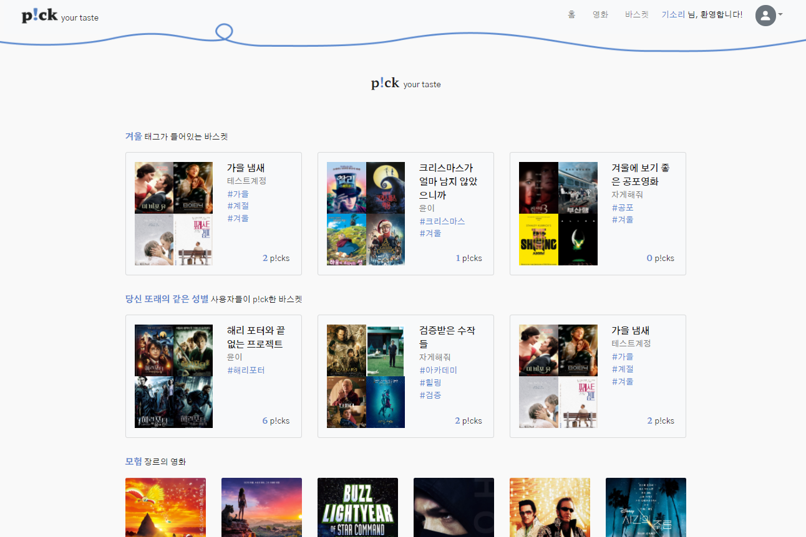

-  사용자의 좋아요, 팔로우 데이터를 바탕으로 바스켓과 영화 추천(자세한 기준은 하기 내용 참고) 

### 1) 바스켓

**[Basket Form]**

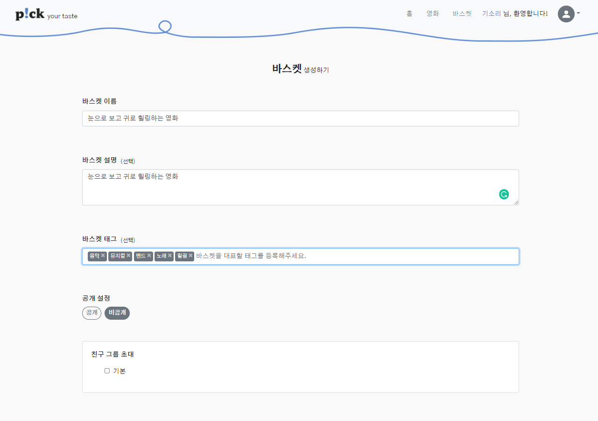

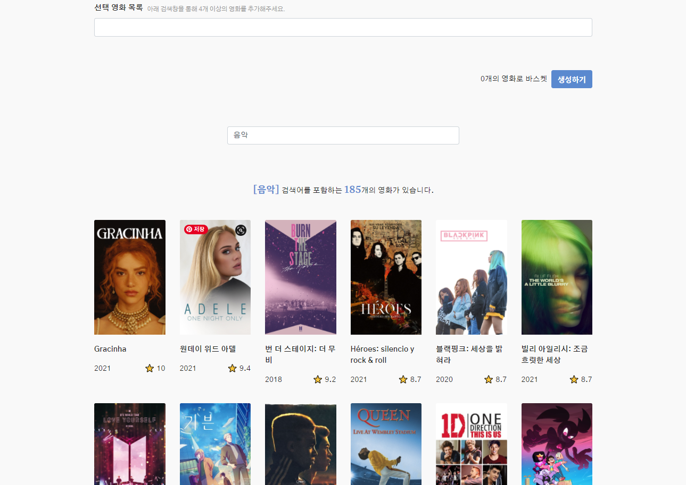

**[Basket Detail]**

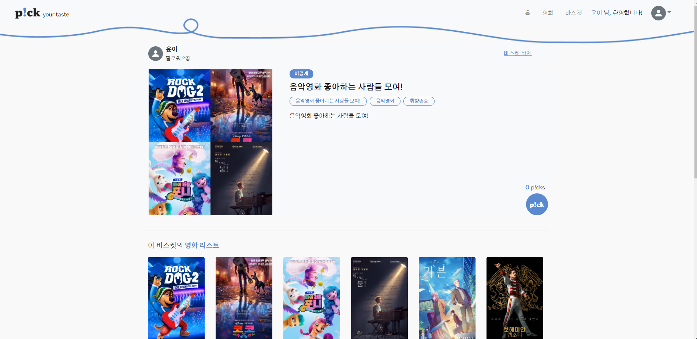

- 취향에 따라 영화 모아두기

- 이름, 설명, 태그 등과 함께 여러 영화를 선택해 바스켓 생성
- 공개/비공개를 설정하여 원하는 유저에게만 바스켓 노출
    - 비공개 설정시, 팔로잉 그룹 별로 참여자로 추가 가능
- p!ck 버튼을 통해 다른 사람이 생성한 바스켓을 프로필 페이지에 저장

**[Basket Section(Recommend)]**

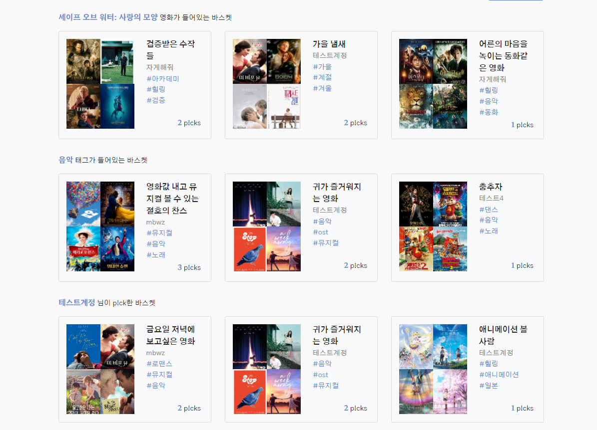

- 사용자가 좋아할 만한 바스켓 추천

- 좋아요, 팔로우를 바탕으로 4가지 기준으로 바스켓을 랜덤 추천
    - **연령과 성별** - 유저와 성별이 같고 연령대가 유사한 유저가 좋아한
    - **좋아한 영화** - 유저가 좋아요를 누른 영화가 포함돼 있는
    - **좋아한 태그** - 유저가 좋아요를 누른 바스켓에 있는 태그가 포함돼 있는
    - **팔로우한 사용자** - 유저가 팔로우한 사용자가 좋아하는

**[Basket Comment]**

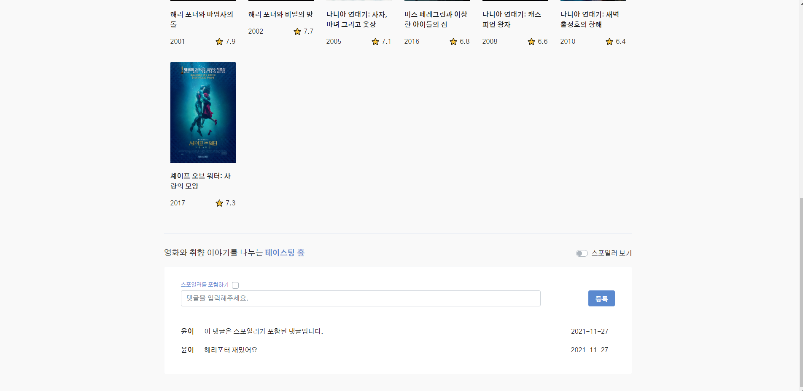

- 바스켓을 커뮤니티 게시글처럼 이용하여 댓글을 작성하고 취향에 대한 이야기를 나누기

- 사용자가 댓글을 작성할 때 스포일러 체크를 하면 다른 사용자들이 스포일러 댓글을 필터링할 수 있음

**[Basket Section(Search)]**

- 검색어를 통해 통합적으로 바스켓 정보 검색

### 2) 영화

**[Movie Detail]**

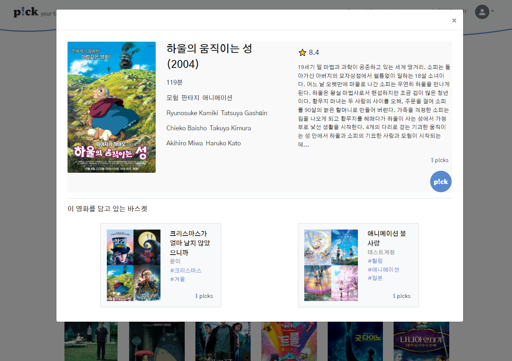

- 영화 디테일
  - p!ck 버튼을 통해 영화를 프로필 페이지에 저장
  - 해당 영화가 담긴 바스켓 확인
  - 제목, 장르, 개요, 개봉일자, TMDB 기준 평점, 배우(6인) 등의 정보를 상세페이지에서 확인 가능

**[Movie Section(Recommend)]**

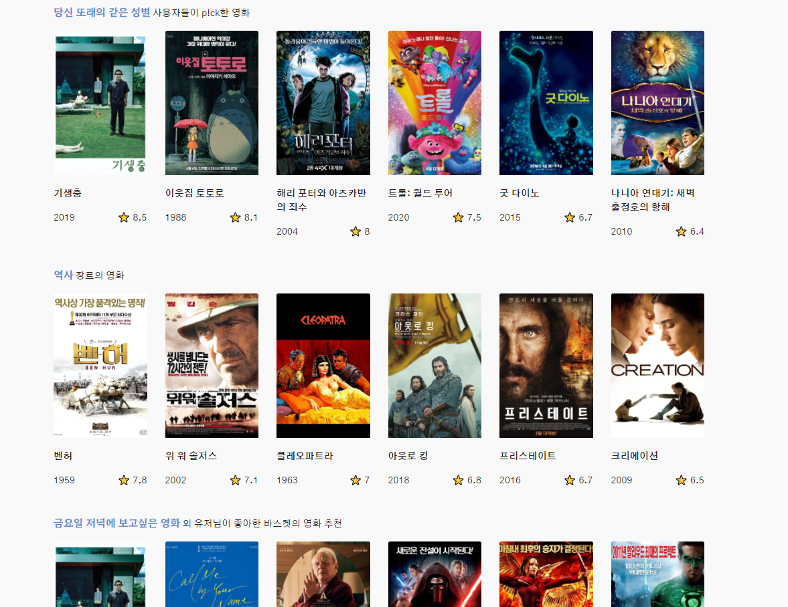

- 사용자가 좋아할 만한 영화 추천

- 4가지 기준으로 영화를 랜덤 추천
    - **연령과 성별** - 유저와 성별이 같고 연령대가 유사한 유저가 좋아한
    - **좋아한 바스켓** - 유저가 좋아요를 누른 바스켓 안에 있는
    - **좋아한 영화의 장르** - 유저가 좋아요를 누른 영화의 장르 중
    - **팔로우한 사용자** - 유저가 팔로우한 사용자가 좋아하는

**[Movie Section(Search)]**

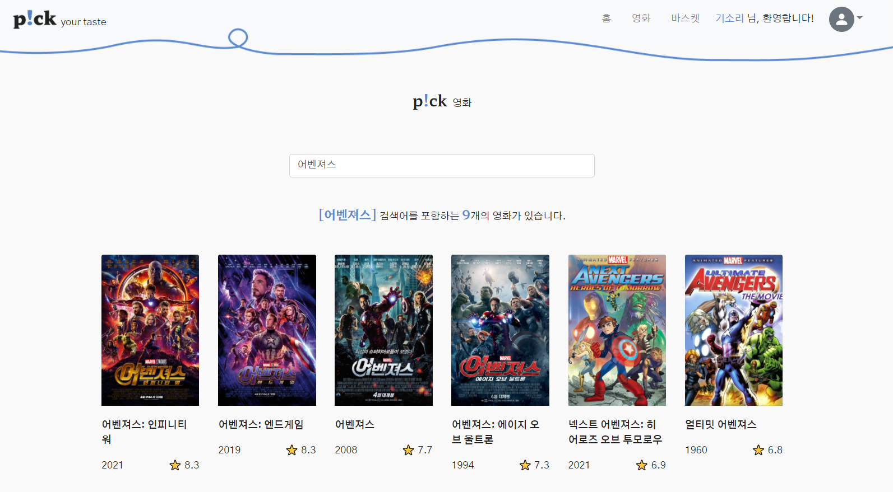

- 검색어를 통해 통합적으로 영화 정보 검색
  - 현재 6,000개의 영화 데이터 존재 (TMDB API)

### 3) 팔로우/그룹관리

**[Profile]**

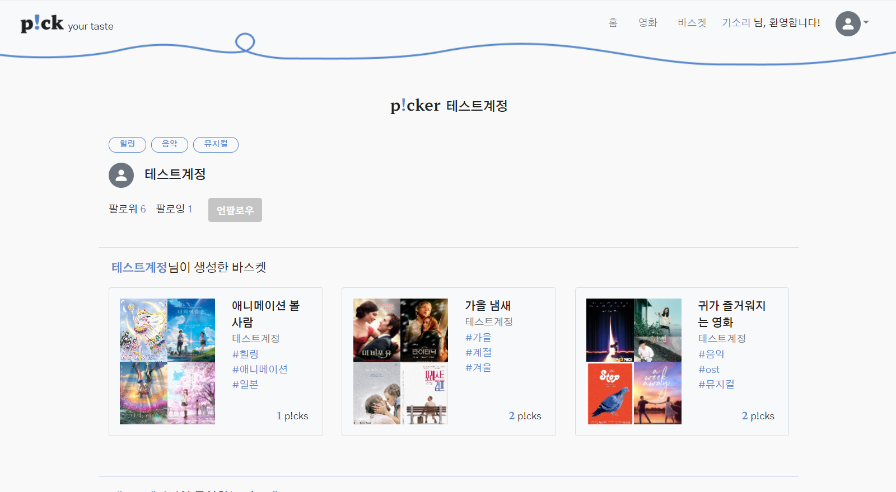

- 팔로우 기능

**[Group Management]**

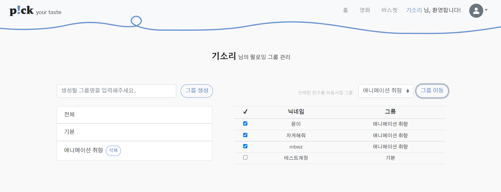

- 팔로우 중인 사용자들을 그룹 별로 관리
  - 타 유저를 팔로우를 하면 '기본' 그룹 내에 들어가며, 그룹 관리 창에서 선택하여 그룹을 이동시킬 수 있음

**[Basket Form]**

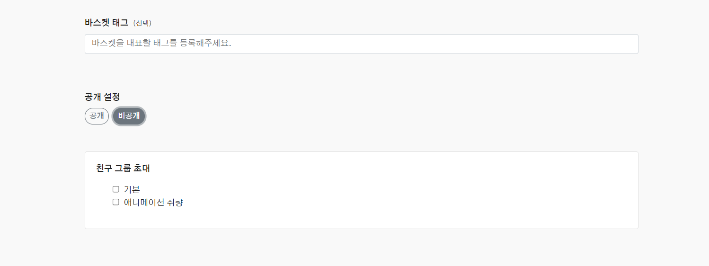

- 비공개 바스켓 생성 시, 특정 그룹 내의 사용자들을 참여자로 추가하여 공개되지 않은 공간에서 편하게 이야기를 나눌 수 있음

### 4) 회원가입/로그인

**[Signup]**

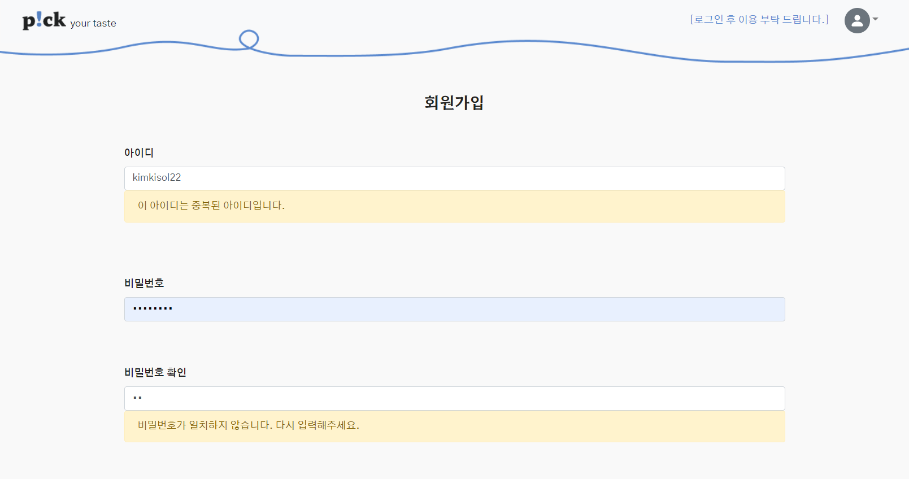

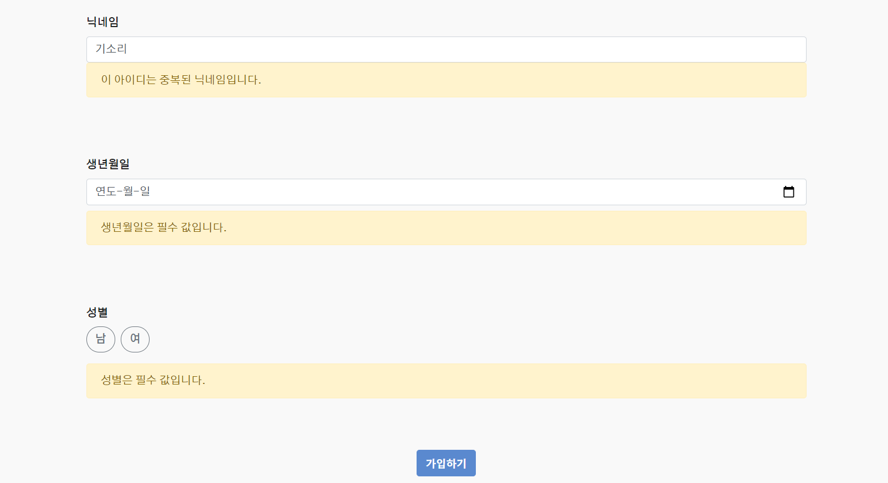

- 중복, 필수, 비밀번호 일치여부 체크

**[Login]**

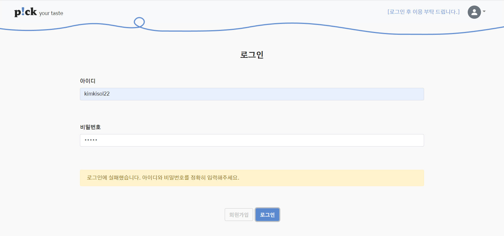

- 아이디, 비밀번호 유효 여부 체크

## 5. 프로젝트 진행시 어려웠던 점

### 1) 복잡한 모델링 구조

1. **Create, Update**
    1. **문제 사항**: 1:N, N:M 관계가 여러 개로 중첩되며 여러 데이터를 전달 받을 때, Create, Update 로직 구현에 어려움이 있었음
    2. **해결 방법**: serializer의 동작 원리에 대한 이해가 필요하다는 것을 느껴 기본적인 내용부터 공부. serializer의 원리 상 save() method가 Create와 Update을 담당한다는 것을 알게 되었고, Serializer 안에서 각각의 메서드를 overriding하여 해결
    3. **배운 점**: 단순히 사용 방법에 대해서만 알고 코드를 작성하는 게 아니라, 기본적인 원리를 이해해야 진행하는 프로젝트에 제대로 적용시킬 수 있음을 배움
2. **추천 알고리즘**
    1. **문제 사항**: 추천할 때 고려할 사항이 많아 알고리즘 구현에 어려움이 있었음
    2. **해결 방법**: Postman 사용을 통해 Response되는 JSON 데이터를 계속해서 체크하며, 어떤 데이터가 내보내지는지 확인, 추가적으로 새로운 orm 문법을 구글링하여 다양한 고려 요소를 적용
    3. **배운 점**: 코드를 다 작성한 후에 내보낸 데이터를 확인하는 것이 아니라, 하나씩 작성하면서 어떻게 동작하고 있는지를 이해하는 것이 중요함을 배움

### 2) 서버-클라이언트 간 정보 교환

1. **추천 알고리즘**
    1. **문제 사항**: 서버에서 전달한 정보를 가지고 클라이언트에서 구현하면서, 실제로 부족한 데이터나 잘못된 데이터가 많았음
    2. **해결 방법**: 백엔드 코드로 돌아가 models, serializers, urls, views 각각을 다 확인해 가며 어디부터 잘못된 건지 찾아가며 해결
    3. **배운 점**: 기본적으로 필요한 데이터를 빠짐 없이 정리한 후 요청하는 것의 필요성을 배움, 추가로 어디서 문제가 생겼는지 코드를 읽기 위해서는 변수명과 주석 같은 디테일한 코드 작성이 매우 중요함을 느낌

### 3) Vuex Store

1. **모듈화**
    1. **문제 사항**: 필요한 기능과 함수가 기존 연습 프로젝트보다 많아 store의 `index.js` 파일이 불편할 정도로 길어짐
    2. **해결 방법**: 주요 기능별 모듈화를 통해 해결
    3. **배운 점**: 협업을 할 때 모듈화를 통해 분업하는 것의 중요성을 배움
2. **persistedstate**
    1. **문제 사항**: 새로고침 시마다 store에 저장된 상태가 비워져서 persisted 플러그인 설치, 그러자 상태가 비워져야 하는 시점에서도 초기화되지 않는 문제 발생
    2. **해결 방법**: 상태 초기화 함수를 mutations에 작성해 초기화가 필요한 시점(ex. 검색 이후)마다 함수를 실행시켜 state 변경
    3. **배운 점**: 어떤 에러 사항이 발생하였을 때, 에러의 근본적인 원인을 추적하는 것의 중요함을 배움
3. **JWT Auth Token**
    1. **문제 사항**: 지속적으로 로그인된 유저 정보를 통해 추천 및 CRUD 기능을 제공해야 하는데, 모듈화를 진행하며 유저 정보의 업데이트가 원활하게 되지 않음
    
    2. **해결 방법**: Vuex와 JWT에 대해 공식문서와 스택 오버 플로우, 그리고 주변 동료들에게 물어보며 JWT가 어떤 원리로 통신되고 Vuex에서 어떻게 적용되는지 이해함. JWT는 Vuex의 각 모듈이 아닌 전역 파일(`index.js`)에 두고 이를 각각의 모듈들이 참조하는 방식으로 해결
    
    3. **배운 점**: 어떤 기능을 쓸 때는 코드 적용부터 하는 것보다는 어떤 원리로 작동하는지 공식문서 등의 방법으로 확인하고 쓰는 것의 중요함을 느낌
    
       

## 6. 느낀 점

### 1) 프로젝트 전반

본격적인 시작 전, 중요 할 일 목록들의 마감 기한을 정해 놓고 시작했음에도 불구하고 최종 마감 때까지 시간이 턱없이 부족하기만 했습니다. 저희 팀은 기획과 디자인을 확실히 잡고 가자는 마음으로 초반에 시간을 많이 쓴 편입니다. 결과적으로는 이러한 선택이 전부 도움이 되었다고 생각하지만 이처럼 마감 기한이 짧은 프로젝트를 수행할 때에는 정말로 핵심이 되는 구현 시간을 더 넉넉히 잡아야겠다고 생각했습니다.

### 2) 프로그래밍

머리로 아는 것과 실제로 적용하는 것 사이의 괴리를 경험했습니다. 분명 배운 것들인데도 프로젝트 상황마다 다르게 적용해야 하거나, 기존에 작성했던 코드를 복기하는 방법만으로는 해결되지 않는 문제들이 많이 발생했습니다.

`django`와 `vue`를 오가며 코드를 작성했기 때문에 문법이나 기본 구조, 디버깅 방법 등이 많이 헷갈렸습니다. 또한, 오류를 추적할 때 `django` 와 `vue`  모두를 확인해야 했기 때문에 체크해야할 사항들이 너무 많았습니다. 하지만 그만큼 백엔드와 프론트엔드의 이해를 모두 갖출 수 있었고, 단순히 나의 파트만 생각하는 것이 아니라 다른 파트까지 고려해야 함을 배웠습니다.

공식문서와 코드를 직접 테스트하며 정확한 이해를 기반으로 문제를 해결해나갔고, 확실히 성장했음을 느꼈습니다. 프로젝트 코드를 처음 작성하던 날보다 마지막 날에 훨씬 빠르고 정확하게  

### 3) 팀워크

Gitlab, Slack, 노션, 디스코드의 여러 가지 커뮤니케이션 툴을 활용하여 프로젝트 진행사항을 공유하고 역할 분담을 하며 진행하였습니다. 이러한 툴들을 통해 서로가 가지고 있는 아이디어와 생각들을 자유롭게 공유하며 '나'만의 프로젝트가 아닌 '팀'프로젝트를 진행할 수 있었습니다.

또한, 짧은 시간에 프로젝트를 진행해야 했던 만큼 각자의 강점을 살려서 더 효율적으로 진행하였습니다. 소통 방법이나 빈도, 무게 등 여러 측면에서 잘 맞는 조합이어서 문제가 발생하거나 서로가 모르는 부분이 있을 때 편하게 물어보고 배려할 수 있었습니다. 

그러나 객관적으로 잘 맞는 편임에도 불구하고, 코드가 길어지다 보니 서로가 작성한 변수명이나 주석 등을 온전히 이해하지 못하는 경우가 생기기도 했습니다. 이런 상황을 미리 예상하고 프로젝트 시작 전에 함께 정할 수 있는 것들을 정해 놨었는데도 몇 번의 오류를 만나고 나니, 소통과 합의의 중요성을 더욱 실감하게 되었습니다. 다른 프로젝트나 현업에서 이번 프로젝트 팀만큼 잘 맞고 많은 시간을 소통할 수 있는 동료를 만날 것이라는 보장이 없기에, 프로젝트 착수 전 반드시 정해야 할 것들에 대한 매뉴얼을 가지고 있어야겠다는 깨달음을 얻었습니다.

### 4) 마지막 한마디

😝 기솔: 기획부터 구현까지 전부 다 진행한 첫 프로젝트였는데, 프로젝트의 한 단계 한 단계가 만만치 않음을 느꼈습니다. 각 단계는 모두 연결되어 있어 다음 단계를 꼭 고려하며 진행해야 함을 배웠습니다. 처음으로 온전히 개발한 사이트인 만큼 아쉬움도 많고, 배운 점도 정말 많았습니다. 이러한 아쉬움과 배운 점이 많은 만큼, 실제 업무에서 여러 부서, 외부 업체와 원활한 커뮤니케이션을 진행할 수 있는 바탕이 될 것 같습니다.

😹 지윤: *AtoZ* 라는 팀명답게 기획부터 디자인, 구현까지 전부 수행해 보았습니다. 원대했던 기획만큼의 결과물을 내지 못해 아쉽기는 하지만, 머릿속으로 생각했던 것을 직접 구현해 나가는 과정의 짜릿함만큼은 역시 잊지 못할 것 같습니다. 업무 분담에 있어서도, 제가 어떤 파트를 자신있게 해낼 수 있고 어떤 파트는 약간 부족한지 알게 되어 추후 진로를 결정함에 있어서도 많은 도움이 될 것 같습니다.